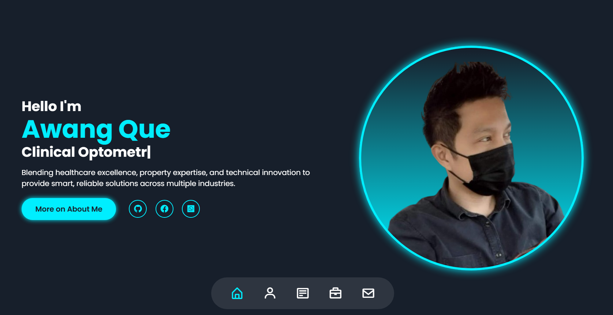

# Personal Portfolio Responsive Website

- Interactive cube navigation, sections are presented as faces of 3D cube.
- Smooth navigation scrolling in each section without reloading.
- Built with plain HTML, CSS, JS - no bootstrap/react/UI frameworks.
- Uses AJAX with Google Forms so the page doesn't refresh when you hit submit.
- All links, navigations and form submission, are totally working - not a plain demo.

---

### Live Site : https://awangque.github.io/ 
### Project Current Version 
 
### Progress : [The Changelog](CHANGELOG.md)

---

### Credits

Layout inspiration derived from a public frontend tutorial. All functionality, data flow, and external integrations were independently implemented as part of a hands-on, framework-free web experiment.

---
### License

MIT License

Copyright (c) 2025 Awg Que

Permission is hereby granted, free of charge, to any person obtaining a copy
of this software and associated documentation files (the "Software"), to deal
in the Software without restriction, including without limitation the rights
to use, copy, modify, merge, publish, distribute, sublicense, and/or sell
copies of the Software, and to permit persons to whom the Software is
furnished to do so, subject to the following conditions:

The above copyright notice and this permission notice shall be included in all
copies or substantial portions of the Software.

THE SOFTWARE IS PROVIDED "AS IS", WITHOUT WARRANTY OF ANY KIND, EXPRESS OR
IMPLIED, INCLUDING BUT NOT LIMITED TO THE WARRANTIES OF MERCHANTABILITY,
FITNESS FOR A PARTICULAR PURPOSE AND NONINFRINGEMENT. IN NO EVENT SHALL THE
AUTHORS OR COPYRIGHT HOLDERS BE LIABLE FOR ANY CLAIM, DAMAGES OR OTHER
LIABILITY, WHETHER IN AN ACTION OF CONTRACT, TORT OR OTHERWISE, ARISING FROM,
OUT OF OR IN CONNECTION WITH THE SOFTWARE OR THE USE OR OTHER DEALINGS IN THE
SOFTWARE.

The above copyright notice and this permission notice shall be included in all
copies or substantial portions of the Software.

THE SOFTWARE IS PROVIDED "AS IS", WITHOUT WARRANTY OF ANY KIND.

